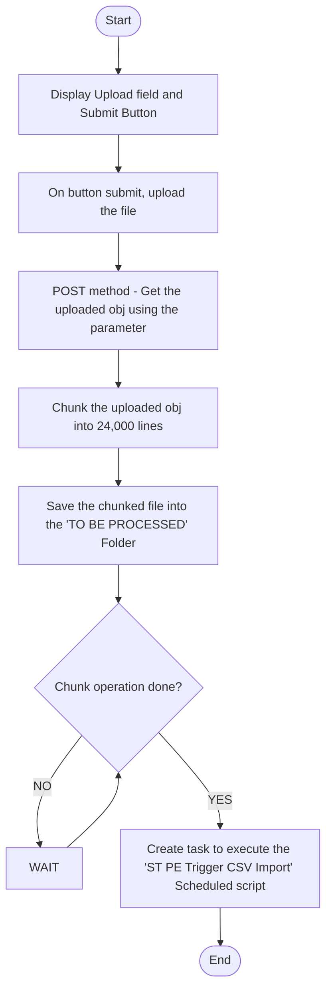

# ST PLE Create File Chunks

## Objective
Provide a way to allow users to upload large CSV files and trigger the CSV import

## Account Details
Account ID: 7309664_SB1
## Execution Frequency
### User Event
### Scheduled Scripts

## Flow Chart

## Similar Project or similar scripts

## Method:
SUITELET
### New Record Fields

### Saved Searches

### Email Templates

### Script Parameters

## Script Name                                  Script ID

Created On  : DECEMBER 2023

Author: SuiteToday

*/
### Task List
- [x] This is a complete item
- [x] Test Scripts

### Project Description / Psuedo Code
// On GET method, create upload field and a submit button
//Display the form
//On POST method, obtain the uploaded obj
//Chunk the obj into 24999 each
//Save the chunks on TO PROCESS FOLDER
//When the chunking is done, create a task to execute the Scheduled script ST PE Trigger CSV Import
//END

